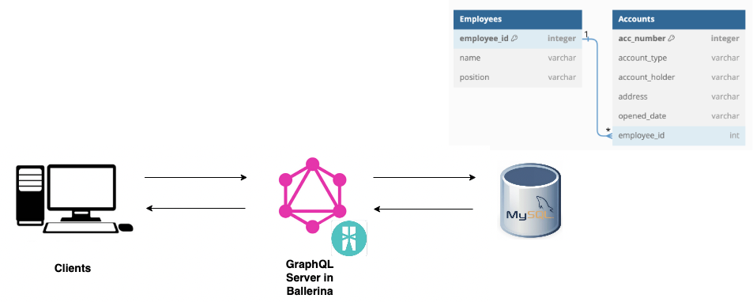

# Ballerina GraphQL - Banking application sample

The data source to the GraphQL server can be anything such as a database, API, or service that holds data. Also, GraphQL can interact with any combination of data sources. In this use case, let’s see how we can implement a GraphQL server using the Ballerina language to expose data in the MySQL database.

The MySQL database holds data about a bank, and it has account details and employee details in two tables. Each account has attached bank employee. So the purpose of this application is to retrieve various data such as
* details of all accounts
* details of a specific account
* accounts under each bank employee




## Repo Details 

[Level 0](https://github.com/anupama-pathirage/ballerina-training-content/tree/graphql-level0/graphql-bank) - Returning hard coded data set.

[Level 1](https://github.com/anupama-pathirage/ballerina-training-content/tree/graphql-level1/graphql-bank) - Connect to DB and get data from DB (With record as output object)

[Level 2](https://github.com/anupama-pathirage/ballerina-training-content/tree/graphql-level2/graphql-bank) - Add filtering with input parameters for objects (With record as output object)

[Level 3](https://github.com/anupama-pathirage/ballerina-training-content/tree/graphql-level3/graphql-bank) - Add filtering with input parameters for fields of the object (With service as output object)

[Level 4](https://github.com/anupama-pathirage/ballerina-training-content/tree/graphql-level4/graphql-bank) - Generate dynamic queries based on the fields requested in the query

## Set up the Database

1. If you are using docker :

2. If you are using MySQL DB instance
Create the sample MySQL database and  populate data with the [data.sql](data.sql) script as follows.
    ```
    mysql -u root -p < /path/to/db.sql

    ```
## Run the code

Execute `bal run` command  within the `graphql-bank` project folder.


## Test the service

To call the GraphQL server, we need to use a client. There are few options to do that.

1. Use the Ballerina GraphQL [Try it tool](https://ballerina.io/learn/vs-code-extension/try-the-services/try-graphql-services/).
2. Use the [built-in GraphiQL client](https://ballerina.io/learn/by-example/graphql-graphiql/) in Balleirna.
3. With [curl](https://curl.se/) by sending an HTTP POST request to the endpoint, passing the GraphQL query as the query field in a JSON payload.

For all the requests the endpoint is  : http://localhost:9094/bank

### Sample Request 1:  Get the details of all the accounts

GraphQL query: 

```json
query {
  accounts {
    number
    accType
    holder
    address
    openedDate
		bankEmployee {
      id
      name
      position
    }
  }
}
```

Response: 

```json
{
  "data": {
    "accounts": [
      {
        "number": 1,
        "accType": "Savings",
        "holder": "Robert Wilson",
        "address": "101 Pine Road, Villagetown, TX 24680",
        "openedDate": "2022-10-01",
        "bankEmployee": {
          "id": 1,
          "name": "Mary Jones",
          "position": "Operations Manager"
        }
      },
      {
        "number": 2,
        "accType": "FD",
        "holder": "Emily Johnson",
        "address": "234 Maple Lane Suburbia, FL 13579",
        "openedDate": "2023-08-16",
        "bankEmployee": {
          "id": 1,
          "name": "Mary Jones",
          "position": "Operations Manager"
        }
      },
      {
        "number": 3,
        "accType": "IRA",
        "holder": "Sarah Brown",
        "address": "456 Elm Avenue Smalltown, CA 98765",
        "openedDate": "2010-10-22",
        "bankEmployee": {
          "id": 2,
          "name": "Jennifer Davis",
          "position": "Operations Manager"
        }
      },
      {
        "number": 4,
        "accType": "Savings",
        "holder": "Lisa Martinez",
        "address": "789 Oak Street Cityville, NY 54321",
        "openedDate": "2022-10-01",
        "bankEmployee": {
          "id": 3,
          "name": "John Smith",
          "position": "Lead Manager"
        }
      }
    ]
  }
}
```

CURL command  to request the same:

```bash
curl -X POST -H "Content-type: application/json" -d '{ "query": "{ accounts { number accType holder address openedDate bankEmployee { id name position }}}" }' 'http://localhost:9094/bank'
```

### Sample Request 2:  Get the details of a specific account ID

> Note : Only after [Level 2](https://github.com/anupama-pathirage/ballerina-training-content/tree/graphql-level2/graphql-bank) of the source code

GraphQL query: 

```json
query {
  accounts(accNumber:2) {
    number
    accType
    holder
    address
    openedDate
		bankEmployee {
      id
      name
      position
    }
  }
}
```

Response: 

```json
{
  "data": {
    "accounts": [
      {
        "number": 2,
        "accType": "FD",
        "holder": "Emily Johnson",
        "address": "234 Maple Lane Suburbia, FL 13579",
        "openedDate": "2023-08-16",
        "bankEmployee": {
          "id": 1,
          "name": "Mary Jones",
          "position": "Operations Manager"
        }
      }
    ]
  }
}
```

CURL command  to request the same:

```bash
curl -X POST -H "Content-type: application/json" -d '{ "query": "{ accounts(accNumber:2) { number accType holder address openedDate bankEmployee { id name position }}}" }' 'http://localhost:9094/bank'
```

### Sample Request 3:  Get the details of a accounts attached to a given employee

> Note : Only after [Level 2](https://github.com/anupama-pathirage/ballerina-training-content/tree/graphql-level2/graphql-bank) of the source code

GraphQL query: 

```json
query {
  accounts(employeeID:1 ) {
    number
    accType
    holder
    address
    openedDate
		bankEmployee {
      id
      name
      position
    }
  }
}
```

Response: 

```json
{
  "data": {
    "accounts": [
      {
        "number": 1,
        "accType": "Savings",
        "holder": "Robert Wilson",
        "address": "101 Pine Road, Villagetown, TX 24680",
        "openedDate": "2022-10-01",
        "bankEmployee": {
          "id": 1,
          "name": "Mary Jones",
          "position": "Operations Manager"
        }
      },
      {
        "number": 2,
        "accType": "FD",
        "holder": "Emily Johnson",
        "address": "234 Maple Lane Suburbia, FL 13579",
        "openedDate": "2023-08-16",
        "bankEmployee": {
          "id": 1,
          "name": "Mary Jones",
          "position": "Operations Manager"
        }
      }
    ]
  }
}
```

CURL command  to request the same:

```bash
curl -X POST -H "Content-type: application/json" -d '{ "query": "{ accounts(employeeID:1) { number accType holder address openedDate bankEmployee { id name position }}}" }' 'http://localhost:9094/bank'
```

### Sample Request 4:  Get the details of a accounts with input arguments in the fields

> Note : Only after [Level 3](https://github.com/anupama-pathirage/ballerina-training-content/tree/graphql-level3/graphql-bank) of the source code


GraphQL query: 

```json
query {
  accounts(employeeID:1 ) {
    number
    accType
    holder
    address
    openedDate
    isLocal(state:"TX")
		bankEmployee {
      id
      name
      position
    }
  }
}
```

Response: 

```json
{
  "data": {
    "accounts": [
      {
        "number": 1,
        "accType": "Savings",
        "holder": "Robert Wilson",
        "address": "101 Pine Road, Villagetown, TX 24680",
        "openedDate": "2022-10-01",
        "isLocal": true,
        "bankEmployee": {
          "id": 1,
          "name": "Mary Jones",
          "position": "Operations Manager"
        }
      },
      {
        "number": 2,
        "accType": "FD",
        "holder": "Emily Johnson",
        "address": "234 Maple Lane Suburbia, FL 13579",
        "openedDate": "2023-08-16",
        "isLocal": false,
        "bankEmployee": {
          "id": 1,
          "name": "Mary Jones",
          "position": "Operations Manager"
        }
      }
    ]
  }
}
```

CURL command  to request the same:

```bash
curl -X POST -H "Content-type: application/json" -d '{ "query": "{ accounts(employeeID:1) { number accType holder address isLocal(state: \"TX\") openedDate bankEmployee { id name position }}}" }' 'http://localhost:9094/bank'
```
