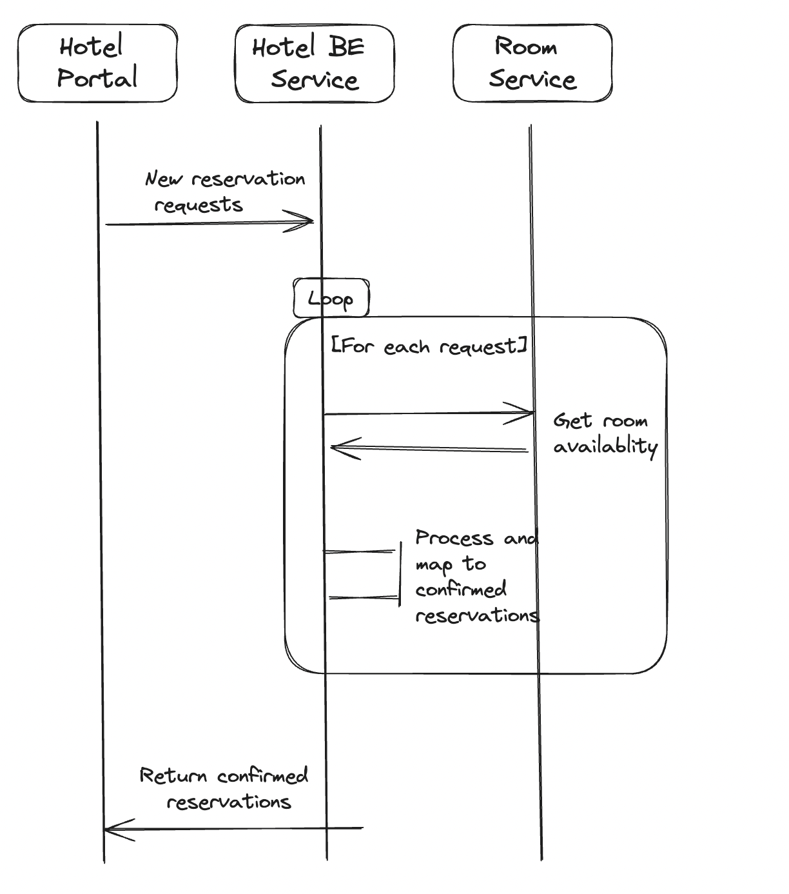

# Ballerina HTTP service for Hotel service



## Task 1 - Create the service and POST resource skeleton with input payload

### Objectives

1. Use service designer to implement the skeleton.
2. Understand JSON -> Record conversions 

### Details

Service base path : `hotel`

Service listner port : `9090`

Resource path : `bookings`

Returns : `error or nil`

Sample input type :

```json
{
  "reservationId": "HOT123456789",
  "guest": {
    "firstName": "Alice",
    "lastName": "Johnson",
    "email": "alice.johnson@example.com",
    "phoneNumber": "+1 (123) 456-7890",
    "address": {
      "street": "789 Hospitality Street",
      "city": "Hospitalityville",
      "state": "CA",
      "zipCode": "98765"
    }
  },
  "reservationDetails": {
    "checkInDate": "2024-05-20",
    "checkOutDate": "2024-05-25",
    "roomType": "queen",
    "totalNights": 5,
    "totalGuests": 2,
    "amenities": [
      "Free Wi-Fi",
      "Breakfast Included"
    ],
    "dayRate": 600.00
  }
}
```

Sample code: 

```ballerina
service /hotel on new http:Listener(9090) {

    resource function post bookings(ReservationRequest[] payload) returns error? {

    }
}
```

### Try out

1. Send a request with sample palyload and observe it returns `202 Accepted` with empty body.
2. Send invalid payload and observe `400 bad request` response on the failure of payload data binding. 


## Task 2 - Create Return payload types and modify POST resource return types

### Sample output payload:

```json
{
    "reservationId": "TEL987654321",
    "user": {
        "name": "Bob Smith",
        "email": "bob.smith@example.com",
        "phoneNumber": "+1 (987) 654-3210"
    },
    "reservationSummary": {
        "checkInDate": "2024-05-20",
        "checkOutDate": "2024-05-25",
        "roomType": "Double Queen",
        "totalGuests": 2,
        "totalCost": 700.00,
        "additionalServices": "Free Wi-Fi, Breakfast Included"
    }
}
```

## Task 3 - Add GET resource 

```ballerina
resource function get bookings() returns Reservation[] {
  
}
```

## Task 4  - Add table and http client for rooms service.

Note : Make reservationId of Reservation readonly.

```ballerina
readonly string reservationId;
```

Rooms service URL : http://localhost:8080/rooms


```ballerina
table<Reservation> key(reservationId) reservationsTable = table [];

http:Client roomsClient = check new ("http://localhost:8080/rooms");
```

## Task 5 - Iterate incoming payload, transform , add to table and invoke room service


Call to room service
```ballerina
boolean availability = check roomsClient->/availability.get(roomtype = request.reservationDetails.roomType, count = request.reservationDetails.totalGuests);
```

## Task 6 - Handle errors using do on fail

Error response 

```json
{
  "error_message": "User already exists"
}
```

## Sample Inputs

### Valid input with 1 reservation

```json
[
  {
    "reservationId": "HOT123456789",
    "guest": {
      "firstName": "Alice",
      "lastName": "Johnson",
      "email": "alice.johnson@example.com",
      "phoneNumber": "+1 (123) 456-7890",
      "address": {
        "street": "789 Hospitality Street",
        "city": "Hospitalityville",
        "state": "CA",
        "zipCode": "98765"
      }
    },
    "reservationDetails": {
      "checkInDate": "2024-05-20",
      "checkOutDate": "2024-05-25",
      "roomType": "queen",
      "totalNights": 5,
      "totalGuests": 2,
      "amenities": [
        "Free Wi-Fi",
        "Breakfast Included"
      ],
      "dayRate": 600.00
    }
  }
]
```

### Valid input with 4 reservations

```json
[
    {
        "reservationId": "HOT1234511789",
        "guest": {
            "firstName": "Anne",
            "lastName": "Johnson",
            "email": "anne.johnson@example.com",
            "phoneNumber": "+1 (123) 456-7222",
            "address": {
            "street": "123 Hospitality Street",
            "city": "Round rock",
            "state": "TX",
            "zipCode": "98765"
            }
        },
        "reservationDetails": {
            "checkInDate": "2024-05-20",
            "checkOutDate": "2024-05-25",
            "roomType": "single",
            "totalNights": 5,
            "totalGuests": 2,
            "amenities": [
            "Free Wi-Fi",
            "Breakfast Included"
            ],
            "dayRate": 600.00
        }
    },
    {
        "reservationId": "HOT1234532241",
        "guest": {
            "firstName": "John",
            "lastName": "David",
            "email": "david@example.com",
            "phoneNumber": "+1 (123) 456-7892",
            "address": {
            "street": "789 Maple Street",
            "city": "Austin",
            "state": "TX",
            "zipCode": "98765"
            }
        },
        "reservationDetails": {
            "checkInDate": "2024-05-20",
            "checkOutDate": "2024-05-25",
            "roomType": "queen",
            "totalNights": 5,
            "totalGuests": 2,
            "amenities": [
            "Free Wi-Fi",
            "Breakfast Included"
            ],
            "dayRate": 600.00
        }
    }
]
```

### Input with room unavailable response

```json
[
  {
    "reservationId": "HOT123456788",
    "guest": {
      "firstName": "Alice",
      "lastName": "Johnson",
      "email": "alice.johnson@example.com",
      "phoneNumber": "+1 (123) 456-7890",
      "address": {
        "street": "789 Hospitality Street",
        "city": "Hospitalityville",
        "state": "CA",
        "zipCode": "98765"
      }
    },
    "reservationDetails": {
      "checkInDate": "2024-05-20",
      "checkOutDate": "2024-05-25",
      "roomType": "queen",
      "totalNights": 5,
      "totalGuests": 2,
      "amenities": [
        "Free Wi-Fi",
        "Breakfast Included"
      ],
      "dayRate": 600.00
    }
  },
  {
    "reservationId": "HOT987654321",
    "guest": {
      "firstName": "Bob",
      "lastName": "Smith",
      "email": "bob.smith@example.com",
      "phoneNumber": "+1 (987) 654-3210",
      "address": {
        "street": "456 Hospitality Lane",
        "city": "Hospitalityville",
        "state": "CA",
        "zipCode": "54321"
      }
    },
    "reservationDetails": {
      "checkInDate": "2024-06-10",
      "checkOutDate": "2024-06-15",
      "roomType": "double",
      "totalNights": 5,
      "totalGuests": 6,
      "amenities": [
        "Swimming Pool Access",
        "Gym Access"
      ],
      "dayRate": 800.00
    }
  },
  {
    "reservationId": "HOT246813579",
    "guest": {
      "firstName": "Charlie",
      "lastName": "Brown",
      "email": "charlie.brown@example.com",
      "phoneNumber": "+1 (555) 123-4567",
      "address": {
        "street": "123 Resort Road",
        "city": "Resortville",
        "state": "FL",
        "zipCode": "12345"
      }
    },
    "reservationDetails": {
      "checkInDate": "2024-07-01",
      "checkOutDate": "2024-07-05",
      "roomType": "single",
      "totalNights": 4,
      "totalGuests": 3,
      "amenities": [
        "Beach Access",
        "Spa Services"
      ],
      "dayRate": 400.00
    }
  },
  {
    "reservationId": "HOT369258147",
    "guest": {
      "firstName": "David",
      "lastName": "Lee",
      "email": "david.lee@example.com",
      "phoneNumber": "+1 (333) 555-7777",
      "address": {
        "street": "789 Resort Lane",
        "city": "Resortville",
        "state": "FL",
        "zipCode": "54321"
      }
    },
    "reservationDetails": {
      "checkInDate": "2024-08-15",
      "checkOutDate": "2024-08-20",
      "roomType": "single",
      "totalNights": 5,
      "totalGuests": 2,
      "amenities": [
        "Ocean View",
        "Private Balcony"
      ],
      "dayRate": 700.00
    }
  },
  {
    "reservationId": "HOT159753486",
    "guest": {
      "firstName": "Emma",
      "lastName": "Brown",
      "email": "emma.brown@example.com",
      "phoneNumber": "+1 (222) 333-4444",
      "address": {
        "street": "456 Resort Avenue",
        "city": "Resortville",
        "state": "FL",
        "zipCode": "67890"
      }
    },
    "reservationDetails": {
      "checkInDate": "2024-09-10",
      "checkOutDate": "2024-09-15",
      "roomType": "double",
      "totalNights": 5,
      "totalGuests": 4,
      "amenities": [
        "Private Beach Access",
        "Room Service"
      ],
      "dayRate": 1000.00
    }
  }
]
```

